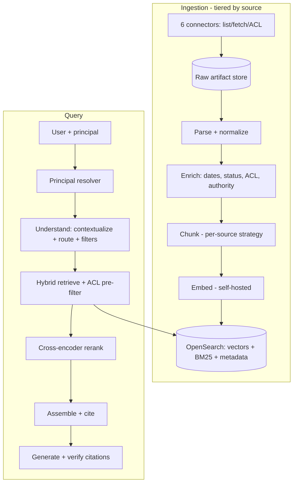

# Scenario Questions

Twenty scenarios: ten production incidents, six design walkthroughs, four leadership situations. These are what a principal-level RAG interview actually spends its time on - the questions in [questions.md](questions.md) establish that you know the mechanism, and these establish that you have run one.

Work them **out loud** for five to ten minutes before reading the answer. The answers here are longer than you should speak; they are written so you can see the reasoning and the numbers, and you should compress each to a two or three minute spoken version.

**Part A** uses **CIDER**: Clarify, Isolate, Decide, Execute, Reflect. Say the clarifying questions out loud even when you then answer them yourself - an interviewer is testing whether you jump to a cause.

**Part B** uses the same spine for design: clarify the corpus and the failure cost, isolate the hard parts, decide the architecture with the arithmetic, execute in a sequence you can defend, reflect on what you would revisit. Part B maps to Q261-Q266.

**Part C** has no scripted answer. Prepare them with real detail using STAR-L, defined in [../01-java/README.md](../01-java/README.md).

---

## Part A - Production incidents

### S1. Answer quality collapsed after a nightly pipeline run

> The internal assistant was fine on Friday. On Monday, users report it "cannot find anything" - it says it has no information on topics that are clearly documented. No application deploy went out. The nightly ingestion pipeline reports success every night, including over the weekend.

**Clarify.** Is it *all* queries or a subset - by source system, document type, tenant, language? Does the failure look like no results, or wrong results? What is the no-result rate compared to last week - do we have that metric? Did anything change in the pipeline, the index, or a dependency over the weekend, including transitive dependency updates? Is the index document count what we expect? Can I fetch a known document by id directly from the store? And what does the pipeline mean by "success" - did it process zero documents (Q208)?

**Isolate.** I would work the diagnostic ladder from Q28, because it separates six causes in minutes and each step is cheaper than the next:

1. **Fetch a known chunk by id** from the vector store. If it is missing, this is an ingestion or index problem. If present, continue.
2. **Query with no filters**. If the document now appears, a filter is the problem - an ACL sync failure, a metadata type change, a tenant mismatch (Q150).
3. **Run an exact (flat) search** for the query vector. If exact finds it and ANN does not, it is an index structure problem - tombstone accumulation, a failed rebuild, or a graph problem (Q66, Q73).
4. **Compare the embedding model version** used at query time against the version recorded on the chunks. **This is where I would expect to land** given "no application deploy" - a transitive dependency update or a provider-side model change means query vectors are now in a different space from the indexed ones (Q202, Q255). The symptom matches exactly: results are returned, scores look normal, and relevance is near-random, which users describe as "cannot find anything".
5. **Read the stored chunk text** - if the weekend run re-ingested with a broken parser, chunks exist and contain garbage (Q16).

The distinguishing evidence between (4) and (5) is the **score distribution**: a model mismatch produces a compressed, shifted distribution across all queries; a parse failure produces normal scores over nonsense text.

**Decide.** If it is a model mismatch, roll back to the pinned model version immediately - it is a configuration change, seconds, and it restores the space the index was built in. If the index itself was rewritten over the weekend with new-model vectors, roll the **index alias** back to the previous snapshot instead (Q200), which is equally fast because the old index is still warm. Diagnose afterwards against the restored baseline.

**Execute.**

1. Confirm the version mismatch by comparing the model identifier on the index metadata to the one the service is using; do not guess.
2. Roll back whichever changed - the model pin or the index alias. Verify with the golden set within 15 minutes (Q174), not by asking a user.
3. Post a status update naming the affected window, because users have been getting bad answers for two days and will not trust a silent fix.
4. Root-cause the change: which dependency, which PR, which auto-update. Expect it to be an unreviewed transitive bump or a provider silently updating a hosted model.
5. **Add the startup assertion** (Q255): the service reads the index's declared embedding model hash and refuses to start on mismatch. This makes the entire failure class impossible rather than merely detected.
6. Add the CI canary that embeds fixed strings and compares to reference vectors within a tolerance.
7. Add the alert that would have caught it Saturday morning: golden-set recall run hourly against production, and a score-distribution shift monitor (Q260 in `08-genai` terms; Q205 here).

**Reflect.** Two lessons. First, **the embedding model is part of the index's identity, not a library dependency** - the whole incident is that one sentence not having been true in our architecture. Second, the pipeline reporting success while quality collapsed is the deeper failure: we monitored activity, not outcomes. The permanent fix is a **canary document per source that is updated and then queried end to end** (Q208), because that single check exercises ingestion, indexing, filtering and retrieval together and would have paged us within an hour.

> Hook: a silent quality failure that ran for days because the monitoring watched jobs rather than results.

### S2. A confidential document surfaced in a search result

> A user in Sales asked the assistant about compensation policy and received an answer quoting an unreleased compensation band document owned by HR. The user was not in the HR group. Legal is asking whether this is a breach and how many other users are affected.

**Clarify.** What exactly did the user receive - a citation, a quote, or a paraphrase? Can we reproduce it? Is the document's ACL in the source system correct, or was it always over-permissive? When did the document enter our index and what ACL did we record at that time? Has the ACL changed since - and when did our sync last run for that source (Q147)? Is the permission filter being applied on all retrieval paths, or is one path (a cache, an admin tool, a batch job) unfiltered (Q157)? How many retrieval requests since indexing returned that chunk id, and to which principals - do our audit logs let us answer that (Q154)?

**Isolate.** Three possible root causes, in decreasing order of severity:

1. **Our filter failed** - a code path without the permission predicate, a cache keyed without scope (Q148), or a post-filter that was skipped. This is a genuine breach and the worst case.
2. **Our ACL data was stale or wrong** - the sync missed a container permission change, or the document was indexed before its restrictive ACL was applied (Q147). Also a breach, but a data problem rather than a code problem.
3. **The source ACL was genuinely permissive** and retrieval merely made the document discoverable (Q155). Not an authorization failure; a discoverability and policy failure.

The audit log settles it: it records the principal set used and the filter applied for every request (Q154). If the filter was present and the document's `allow_principals` included a group the user was in, we are in case 2 or 3, and comparing our stored ACL to the source system's current ACL distinguishes them.

**Decide.** Regardless of which case, the immediate action is the same and it is not "investigate first": **remove the document from the index now** - a targeted delete plus cache invalidation by source id (Q156). Then answer the blast-radius question from the audit log, because Legal's real question is "who else saw it", and a system that cannot answer that has a second problem. Then fix the root cause.

**Execute.**

1. Delete the document's chunks from every index and purge every cache entry tagged with its source id; verify with a query (Q198).
2. Query the audit log for every request that retrieved that chunk id, with principal and timestamp. Produce the affected-user list for Legal with numbers, not adjectives.
3. Determine the root cause from the audit evidence: filter present or absent, ACL stored versus source.
4. **If case 1:** treat as a security incident - fix the path, add the contract test that a `Retriever` cannot be called without a scope, and run the full cross-tenant/permission suite (Q157). Consider whether other over-permissive results were served.
5. **If case 2:** audit ACL sync freshness for that source, measure the reconciliation drift (Q147), and add the drift metric as an alert. Then re-verify the ACLs of the whole source, not just this document - there are almost certainly others.
6. **If case 3:** report it as a policy finding, not a breach (Q155), and ship the `searchable: false` capability so content owners can exclude documents from retrieval without renegotiating source ACLs.
7. Add a **late verification** step on the final k chunks for sensitive-tier documents (Q147), closing the sync window where it matters.

**Reflect.** The lesson I would take publicly is that **retrieval makes the implemented permission model visible**, and most organizations' implemented model is more permissive than their intended one. That is not our defect but it is now our problem, and the durable answer is a pre-launch ACL audit of every source plus the ability to exclude documents from retrieval independently of source permissions. The lesson I would take internally is that the audit log is what made this a two-hour investigation rather than a two-week one - and I would say so, because that is how you get investment in the unglamorous parts. 

> Hook: an incident where the logging you had built earlier determined how the conversation went.

### S3. Retrieval cost doubled with no traffic change

> The monthly bill for the retrieval platform went from roughly 12 to 25 thousand dollars. Query volume is flat within 3 percent. The team has changed nothing they can think of.

**Clarify.** Which line item doubled - embedding, generation, reranking, infrastructure? Do we have cost broken down by component *and* by caller (ingest versus query)? When did it start - a step change or a ramp? Did the corpus grow? Did chunk count grow faster than document count? Did any feature flag change? What is the prompt-cache hit rate now versus a month ago? Are we running an evaluation suite more often (Q234)?

**Isolate.** The framing that solves this fast: **flat query volume means the change is either per-request size, a cache regression, or ingestion-side work** (Q140, Q236).

Check in this order:

1. **Cost by component.** If it is embedding, it is almost certainly ingestion-side - a reprocessing loop, a re-embedding job, contextual enrichment turned on, or a broken content-hash check causing nightly re-embedding of the whole corpus (Q236). This is the most common cause and the easiest to confirm: embedding tokens by caller over time.
2. **If it is generation input tokens:** average prompt tokens per request, broken down by section (Q140). A chunk-size increase, a k increase, parent expansion turned on (Q37), or history no longer being truncated will all show here.
3. **Prompt cache hit rate.** A prompt-template change that moved a variable element above the static prefix drops the hit rate to zero and roughly doubles effective input cost overnight, with no other symptom (Q134). This is the sneakiest cause and matches "changed nothing they can think of", because a prompt edit does not feel like a cost change.
4. **Retries.** A provider degradation causing retries means paying twice for many requests (`08-genai` Q236).
5. **Infrastructure:** an index that grew past a memory threshold and triggered a scale-up.

**Decide.** Stop the bleeding first if it is ingestion-side - pause the offending job, since a loop can add thousands of dollars a day. If it is prompt-cache or context size, it is a configuration fix, so ship it through the normal gate with an eval run rather than hot-patching. In parallel, put a **cost ceiling and alert** in place, because the absence of one is why this ran for a month.

**Execute.**

1. Build the cost-by-component-and-caller breakdown if it does not exist - a few hours, and it is the artifact that prevents the next occurrence (Q259).
2. Identify and stop the dominant term.
3. Fix the root cause: content-hash idempotency in ingestion (Q26), or prompt layout restored for caching (Q134), or k reduced to the measured optimum (Q128).
4. Verify with a day of data that the run rate returned; do not declare victory on a projection.
5. Add: a daily spend alert with a threshold, a per-component budget, tokens-per-request-by-section as a tracked metric, and prompt-cache hit rate on the dashboard.
6. Add a cost regression check to the release gate - cost per query is a gated metric alongside quality (Q178).

**Reflect.** The pattern here is that RAG cost defects are **small numbers multiplied by big numbers**, invisible per request and enormous in aggregate. The structural fix is not vigilance, it is attribution: cost per request, broken down by component, on a dashboard someone reads weekly, plus a gate that fails a release whose cost per query moves more than a threshold. I would also flag that a month is far too long a detection time for a doubling, and set the alert accordingly.

> Hook: a cost defect you found, the breakdown that exposed it, and the gate you added.

### S4. Users report the assistant is confidently wrong about a policy

> Support agents say the assistant states the refund window is 14 days. The current policy says 30. The correct document is in the corpus, is current, and is retrievable when searched directly.

**Clarify.** Is the wrong document being retrieved, or is the right one retrieved and ignored? What is in the context for that query - can I see the chunk ids and scores (Q252)? Is the 14-day statement in our corpus somewhere, or did the model invent it? When did this start? Is it every phrasing of the question or specific ones? Which audience - is the wrong answer for a segment where 14 days was once correct?

**Isolate.** Run the query and read the trace. Three outcomes and each has a different fix:

1. **A stale document is retrieved and ranked above the current one.** The 14-day figure exists in a deprecated FAQ (Q121). The current policy may also be in the context but lower, or absent. The most common cause by far.
2. **The right document is retrieved and the model answered wrong** - either the answer straddles chunks, the relevant chunk sits mid-context (Q129), or it answered from parametric knowledge because 14 days is a common industry norm (Q180). The oracle test settles it: put only the correct chunk in the context and re-run (Q6).
3. **Both documents are retrieved and the model chose the wrong one** - a conflict-resolution failure, usually because dates and status are not in the context block so the model has no basis for preferring one (Q132, Q187).

I would expect (1) or (3), and the distinguishing evidence is right there in the chunk ids.

**Decide.** Immediate mitigation: an editorial bury or exclusion on the stale document, plus a pin of the correct one for this query class (Q95) - minutes, and it stops agents giving customers wrong terms today. Then fix the class, not the instance, because there are certainly other superseded documents behaving the same way.

**Execute.**

1. Exclude the deprecated document from retrieval now; verify the answer corrects.
2. **Add status and date metadata to the context block** if it is not there (Q132), and a prompt rule to prefer current sources and surface conflict (Q187). This is a same-day change with a broad effect.
3. **Detect deprecation at ingestion** - superseded banners, `effective_to` dates, status fields - and set metadata (Q121, Q23). This is the generalizable fix and takes a sprint.
4. Add a **deprecation penalty** in the policy ranking stage (Q120) so stale content ranks below current content without disappearing.
5. Ask the corpus owner to archive or delete the superseded document at source - the real fix, and the one that needs a governance conversation.
6. Add golden-set cases for the stale-versus-current pattern across several policy areas, and a corpus-wide report of near-duplicate documents with conflicting content (Q23), which will surface the rest.

**Reflect.** The technical lesson is that **a ranking symptom usually has a metadata root cause** (Q121) - and fixing it in the ranker is a per-document patch while fixing it at ingestion is a per-class solution. The organizational lesson is more important: the corpus contains contradictions, and no retrieval system can be truthful over an untruthful corpus. I would present the near-duplicate conflict report to the content owners as a finding with numbers, because that converts "the AI is wrong" into "we have 340 superseded documents still live", which is a problem they own and can fix.

> Hook: a quality complaint you traced to content governance rather than to the model.

### S5. p99 latency tripled after a routine index rebuild

> Retrieval p50 is unchanged at 60 ms. p99 went from 200 ms to 900 ms immediately after the weekly index rebuild and alias swap. It has not recovered after four hours.

**Clarify.** Did it start exactly at the alias swap? Is the tail concentrated - by tenant, by filter shape, by node, by query type? What is the new index's memory footprint versus the old? Are all replicas affected or a subset? What is the page-fault rate and the resident set size on the query nodes? Did the rebuild change any parameters - `M`, `efConstruction`, quantization, dimensions? Did the corpus grow materially in this rebuild? Is maintenance (merges, compaction) still running on the new index?

**Isolate.** Immediately-after-swap plus a normal p50 points at a small subpopulation paying a large cost. Candidates (Q71, Q231):

1. **Cold page cache** (Q240). The new index's pages are on disk; most queries hit warm regions, and unlucky ones fault. Classic signature: p50 fine, p99 terrible, gradually improving. **But this has not recovered in four hours**, which argues against it *unless* the index no longer fits in RAM.
2. **The index no longer fits in memory.** If the corpus grew and the new index crossed the RAM threshold, a fraction of queries permanently touch disk. This is a cliff, not a slope, and it matches "did not recover" precisely (Q237). I would check resident set versus index size first.
3. **Filtered queries falling off the recall cliff** on a differently-structured graph (Q72, Q150) - possible if the rebuild changed segment structure.
4. **Background merges or maintenance** still running on the new index (Q207).
5. **A parameter change** in the rebuild - a higher default `ef_search`, or quantization removed so vectors are larger.

**Decide.** If it is memory (2), the fix is capacity - scale up the nodes or shard further - and the interim mitigation is to **roll the alias back to the previous index** (Q200), which is seconds and restores service while we provision. That is the strength of blue-green and I would use it rather than debugging in production under a degraded SLO.

**Execute.**

1. Check resident set versus index size on the query nodes. This one measurement distinguishes (1) and (2) from the rest.
2. Roll back the alias if the old index is still resident; confirm p99 recovers, which also confirms the diagnosis.
3. Provision correctly - more memory, or enable quantization plus rescoring to shrink the hot index (Q68-69), or add a shard (Q80).
4. Rebuild, **warm the new index before the swap** by replaying recent queries against it (Q240), and validate p99 under synthetic load as part of the pre-swap validation gate (Q200) - which is the missing step that let this reach users.
5. Add alerts on memory headroom (not just utilization) and on the ratio of index size to available RAM, so the next growth crossing is predicted rather than experienced.

**Reflect.** Two things. First, **blue-green paid for itself** - the rollback took seconds because the old index was still there, and I would use that concretely to defend the standing cost of double capacity, which someone questions every budget cycle. Second, the pre-swap validation checked correctness (document counts, golden set) but not **performance under load**, and a validation gate that only checks quality will let a capacity regression straight through. Adding a load check to the gate is the permanent fix.

> Hook: a capacity cliff you hit, and the pre-deployment gate that now catches it.

### S6. The evaluation suite is green while the support team is angry

> Golden-set recall@10 is 0.94 and end-to-end correctness is 0.88, both stable for two months. The support organization says the assistant has "gotten worse" and they have stopped using it for anything hard.

**Clarify.** What specifically got worse, with examples? When did they notice? What does "hard" mean - which query types? Is the support team a segment in our evaluation, and if so what does their slice show (Q175)? What has changed in the last two months - corpus, prompt, model, retrieval config? What is the no-result rate and abstention rate over that period? Are we measuring latency and did it change? Have we read any of their actual sessions?

**Isolate.** The first move is not analysis, it is **reading 30 of their real failing sessions**. Metrics that disagree with users are usually measuring a different population or a different property (Q163, Q173). What I expect to find, in some combination:

1. **Segment blindness.** The golden set is dominated by common questions; support asks the hard residue. 0.94 overall can be 0.98 on the easy 80 percent and 0.75 on their 20 percent.
2. **A failure mode the metric cannot express** - incomplete answers, over-eager abstention, lost multi-turn context, degraded citation quality, or latency. Recall@10 is blind to all of them.
3. **Corpus drift** - new document types or a source added, changing the retrieval landscape while the golden set stayed fixed (Q205). The eval measures a corpus that no longer exists.
4. **Golden-set staleness** - labelled spans that no longer exist, so the metric is scoring against a fossil (Q162).
5. **Something genuinely non-retrieval** - a UI change, a rate limit, a tone change from a model update.

**Decide.** Treat this as an **evaluation failure first and a quality failure second**. The metric's job was to tell us this and it did not, so fixing the metric is the durable outcome; fixing the specific complaints is the immediate one. I would not defend the number.

**Execute.**

1. Collect 30-50 concrete failing cases from the support team, with their expected answers. Reproduce each and classify the failure mode.
2. Check whether each failure mode is *representable* in the current eval set - typically most are not, and that finding is the headline.
3. Rebuild the golden set from **sampled production logs**, stratified by user segment, query type, turn position and answerability, with support's cases included and labelled (Q162).
4. Add the missing measurements: per-segment slices with their own floors (Q175), abstention correctness (Q176), multi-turn cases (Q99), citation validity (Q169), latency.
5. Re-run against the new set. Expect the number to drop substantially - and say so in advance, so a lower number is understood as better measurement rather than a regression.
6. Fix the top failure modes by frequency and severity, measured against the new set.
7. Close the loop with the support team explicitly: show them their cases in the suite and the before/after. A team whose report is measured and answered keeps reporting.

**Reflect.** The lesson is that **the people closest to the failure are usually right about the failure and wrong about its prevalence** (Q173) - and a metric that never disagrees with users is a metric nobody is stress-testing. The permanent process change is that every reported quality issue becomes a labelled eval case, so the suite tracks reality by construction, and per-segment floors gate releases rather than an aggregate that any large segment can carry.

> Hook: a green dashboard over an unhappy user group, and how you rebuilt the measurement without dismissing them.

### S7. A document was deleted for GDPR and is still being cited

> Three days after processing an erasure request, a user's answer cited content from the deleted document. Legal has been told the deletion was complete.

**Clarify.** Which surface cited it - a live retrieval, or a cached answer? Do we have the request trace showing which chunk ids were used (Q154)? Was the deletion applied to all stores, and do we have verification evidence? What is our documented deletion SLA and what did we tell the data subject? Is the document also present under a different source id (a duplicate from another system)? Was the deletion propagated to caches, and were cache entries tagged with source ids?

**Isolate.** Walk the enumeration from Q156 and check each location, because the answer is always "one of the derived artifacts":

1. **Vector index** - deleted or only tombstoned? A tombstone excluded from results is acceptable for discovery but **not** for erasure (Q206).
2. **Lexical index** - deleted in one engine and not the other (Q92, Q152).
3. **Caches** - retrieval results, reranker scores, semantic answers. If entries were not tagged with source ids, nothing invalidated them (Q148, Q153). **My first suspicion**, because it is the most commonly missed.
4. **A duplicate under a different id** - the same document ingested from two sources and only one deleted (Q24).
5. **A derived artifact** - a summary chunk, a hierarchical node, a contextual enrichment (Q218), each with its own id and no lineage back to the source.
6. **Conversation history** carrying the content forward from a prior turn (Q141).
7. **A stale replica or an index snapshot** still serving (Q77).

The trace tells you which chunk id was used, which immediately identifies the surviving location.

**Decide.** Purge the specific surviving copy immediately and verify. Then - and this is the part that matters to Legal - **re-verify the full enumeration for this document and for the last N erasure requests**, because if one location was missed here, it was missed for all of them. Report accurately rather than reassuringly; an under-stated erasure failure that is later discovered is far worse than a corrected one.

**Execute.**

1. Purge the identified location; run a verification query across every store and cache asserting zero results (Q198).
2. Re-run verification for all prior erasure requests in the retention window; quantify any others still surviving and report to Legal with numbers.
3. Build the **deletion verification job** as a permanent step in the erasure workflow: after processing, query every store and cache and assert absence, failing the workflow if not. Erasure is not complete until verification passes.
4. Fix the root cause: source-id tags on every cache entry (Q148), lineage from derived artifacts back to source documents, and hard-delete (compaction) rather than tombstone for erasure (Q206).
5. Reconcile duplicates: erasure must operate on the **duplicate cluster**, not a single source id (Q24).
6. Document the honest guarantee - live systems within X hours, backups within the rotation cycle - and make sure that is what Legal has told the data subject (Q156).

**Reflect.** The structural lesson is that **every derived artifact inherits the obligations of its sources**, and that erasure lineage must be designed at ingestion because it cannot be retrofitted. I would also raise the fine-tuning implication proactively: if we ever train on corpus content, erasure becomes impossible in principle (Q56), which is a strong argument against it that is much easier to make before someone has built it than after.

> Hook: a compliance obligation that turned out to be an architecture requirement, and the enumeration you produced.

### S8. Two users get different answers to the same question

> A customer-success manager and their colleague ask the assistant the identical question thirty seconds apart and get materially different answers. Neither is wrong exactly, but the difference is embarrassing in front of a customer.

**Clarify.** Are they in the same permission groups? Same tenant, same locale, same product context? Did they use identical wording, or is one a follow-up in an existing conversation? Are the retrieved chunk ids the same in both traces? Are they hitting the same index replica? What is the generation temperature? Is a semantic cache serving one of them?

**Isolate.** Sources of divergence, in the order I would check because each is cheap to test:

1. **Different permissions** (Q144). Legitimate and expected, but it needs to be *explainable* - and often surprising to the users, who assume they see the same corpus.
2. **Different retrieved sets from the same query** - the same chunk ids should come back. If they differ: replica divergence (independently built HNSW graphs, differing segment states, replication lag - Q77), or a semantic cache hit for one user (Q233).
3. **Conversation context.** One is a follow-up, so contextualization rewrote the query differently (Q99). Very common and easily mistaken for nondeterminism.
4. **Generation sampling.** Even at temperature 0, output is not guaranteed identical (`08-genai` Q30). If the retrieved sets match, this is the residue, and it produces *phrasing* differences rather than *substantive* ones.
5. **A canary or A/B assignment** placing them in different variants (Q256) - check first, actually, because it is a one-line answer.

The trace comparison settles it in minutes: same principal scope? same chunk ids? same rewritten query? same descriptor version?

**Decide.** The engineering response depends on the cause, but the *product* response is the same and I would lead with it: for a customer-facing use, **consistency is a feature**, and the system should be designed so that two colleagues asking the same thing see the same evidence. That points at deterministic retrieval plus sticky routing, not at chasing temperature.

**Execute.**

1. Compare the two traces; identify the divergence point.
2. If replica divergence: implement **sticky routing** by session, deterministic tie-breaking on a stable id, and monitor replication lag as a product metric (Q77). Prefer distributing a *built* index artifact over building per replica.
3. If a semantic cache hit: this is a bug in disguise - the cached answer was for a similar-not-identical question or a different scope. Tighten or remove it (Q233).
4. If contextualization: make the rewritten query visible in the UI ("searching for: refund window, enterprise plan"), which turns an invisible divergence into an understandable one and lets users correct it (Q104).
5. If permissions: surface it - "results limited to documents you have access to" - and give a request-access path (Q189).
6. Set generation temperature to 0 for factual answering, and accept that residual variation exists.
7. Add a consistency check to the eval: run each golden query several times and measure retrieved-set stability and answer agreement. Most teams never measure this and it is cheap.

**Reflect.** The insight worth stating is that **users judge an assistant on consistency more harshly than on accuracy** - a system that is right 90 percent of the time consistently feels more trustworthy than one that is right 95 percent of the time variably, because variability destroys the mental model. So determinism in the retrieval path is worth real engineering effort even when it does not move a quality metric.

> Hook: a nondeterminism complaint you resolved, and what you made deterministic on purpose.

### S9. Ingestion silently stopped for one source

> A weekly review notices that a source system's documents have not changed in the index for eleven days. The ingestion pipeline shows green for every run. Users have not reported anything, but that source is the company's engineering documentation.

**Clarify.** When exactly did the last document from that source get indexed? What does the pipeline's "success" mean for that source - how many documents did it process each night (Q208)? Has the source's API changed, or its credentials? Is the watermark corrupted - set to a future date? Are other sources fine? Do we have a freshness metric per source, and if so why did it not alert?

**Isolate.** The near-universal cause of this shape (Q208): **the pipeline succeeded at doing nothing.** It called the change API, received an empty list, processed zero documents successfully, and exited 0. Sub-causes:

1. **Expired credentials** returning an empty result or an unhandled 401 that was swallowed as "no changes". The single most common root cause.
2. **A corrupted or future-dated watermark**, so `modified_since` matches nothing.
3. **An API change** - a renamed field, a changed pagination contract - returning an empty page.
4. **A filter** in the connector excluding everything after a configuration change.
5. **The source genuinely has not changed** - possible, and worth ruling out, but eleven days for engineering documentation is implausible.

**Decide.** Fix the immediate gap and then fix the monitoring, in that order but with the monitoring treated as the real deliverable - because the pipeline will fail again in some new way and the only durable protection is outcome monitoring.

**Execute.**

1. Reproduce the connector's change call manually; identify the failure. Rotate credentials or repair the watermark.
2. Backfill the eleven-day gap by resetting the watermark and replaying; verify document counts against the source.
3. Verify end to end: pick a document known to have changed and confirm the assistant answers with the new content.
4. **Add per-source freshness lag as the primary alert**: `now - max(indexed_at)` per source against that source's SLO (Q195, Q210). This catches the entire class, including causes we have not imagined.
5. Add expected-versus-actual document volume per source against a rolling baseline, alerting on large deviations in either direction.
6. Add a **canary document per source** - a synthetic job updates it and asserts retrievability within the SLO (Q208). This exercises ingest, index, cache and query together.
7. Add credential expiry tracking with advance alerts, since that is the root cause here and it will recur across twelve connectors.
8. Add the reconciliation crawl comparing source document counts to indexed counts, with drift as a monitored metric (Q196).

**Reflect.** The lesson is precise and worth stating as a principle: **monitor outcomes, not activities.** Every job-level metric was green because the job did exactly what it was told and what it was told was wrong. The corollary is that "no data" and "no change" look identical to any activity-based monitor, so freshness - a property of the corpus, not of the pipeline - is the only signal that catches it. I would also note that nobody reported it for eleven days, which tells us something uncomfortable about how much the engineering documentation was being used, and that is worth investigating separately.

> Hook: a silent failure that ran for days, and the outcome metric that now catches its whole class.

### S10. The assistant is answering from stale product documentation for one customer

> A large enterprise customer on a bespoke contract reports that the assistant quotes terms from their previous contract. The current contract is indexed. Their tenant filter is working - they see only their own documents.

**Clarify.** Are both contracts in their tenant's corpus? Is the old one marked superseded anywhere? What are the retrieval scores for both? Do the chunks carry effective dates (Q132)? Was the new contract indexed with the correct metadata, or did it come through a different path (a manual upload, a different connector) that skipped enrichment? Is the old one being boosted by anything - length, keyword density, popularity?

**Isolate.** Tenant isolation is working, so this is a **ranking and lifecycle** problem within a tenant (Q121), not a permission one. Likely mechanisms:

1. **No lifecycle metadata.** Both contracts are equally "current" as far as the index knows, so ranking is decided by textual similarity, and the older document may simply be a better lexical match (longer, more repetitions of the query terms).
2. **The new contract was ingested through a different path** - a one-off upload - and did not receive effective dates, status or authority tier (Q25). Very common with bespoke enterprise documents.
3. **The old contract has more chunks** (it may be longer or chunked under an older chunker version), so it dominates top-k by count (Q27).
4. **Near-duplicate content** - the two contracts are 90 percent identical, so both retrieve and the model picks the wrong one because nothing distinguishes them in the context (Q131's dedup collapsing them, or Q187's conflict with no dates).

**Decide.** Immediate: exclude the superseded contract from that tenant's retrieval - a metadata update, minutes. Then fix the class, because every enterprise customer with a renewed contract has this problem latent, and the next report will be a worse one (a customer quoted incorrect commercial terms).

**Execute.**

1. Set `status: superseded` and `effective_to` on the old contract; verify the answer corrects.
2. **Audit the whole class**: for every tenant, find documents that are near-duplicates with different dates (Q23-24) and flag superseded ones. Expect this to be a meaningful list.
3. Make contract lifecycle metadata **mandatory at ingestion** for this document class - a document without `effective_from` is rejected to a review queue rather than indexed (Q26). Fail closed on the fields that determine correctness.
4. Fix the ingestion path gap: the manual-upload route must run the same enrichment as the connector route. One pipeline, many sources (Q30).
5. Add effective dates and status to the context block and the conflict-handling prompt rule (Q132, Q187), so even if both retrieve, the model prefers and explains correctly.
6. Add golden-set cases per tenant for superseded-versus-current, and a corpus-level report of unresolved near-duplicate conflicts delivered to the account teams.

**Reflect.** The general lesson is that **a second ingestion path is a second set of invariants to violate** - the manual upload existed because someone needed a document indexed quickly, and it bypassed exactly the enrichment that makes ranking correct. The permanent fix is not to forbid the fast path but to make it use the same pipeline with the same required fields. Second, in a multi-tenant product this class of error is per-customer and therefore commercially dangerous in a way an internal tool's errors are not, which justifies a stricter gate: mandatory lifecycle metadata, and per-tenant eval slices (Q175).

> Hook: a shortcut path in your own system that skipped a control, and how you closed it without slowing people down.

---

## Part B - Design walkthroughs

### S11. An internal knowledge assistant over 4 million documents (Q261)

> Six source systems, per-user permissions, 3-second response target, 20,000 employees.

**Clarify.** What are the six sources and which have machine-readable ACLs (Q144)? What is the freshness requirement per source (Q195)? What does the 3 seconds mean - to first token or to complete answer? What is the acceptable failure mode: a wrong answer, or a refusal? What is the query volume and its shape? Is there a budget? What exists already - a search system, an eval set, a content governance function?

**Isolate the hard parts.** Not the vector search. The hard parts are: **permission-aware retrieval across six incompatible ACL models** (Q158); **corpus quality** - contradiction, staleness and duplication across sources (Q23); **evaluation**, since without it nothing can improve; and **freshness per source** with a tiered pipeline (Q210).

**Arithmetic.** 4M documents × ~8 chunks = **32M chunks**. At 1024-d int8 plus HNSW graph: 32M × (1024 + ~250) ≈ **41 GB** - comfortably one large machine plus replicas (Q70), so the index tier is not the challenge. 20,000 employees at, say, 5 queries/day = 100k queries/day ≈ **1-3 QPS average, 20 QPS peak**. That is small: two or three replicas is ample. Cost at ~$0.003/query (Q235) is roughly **$300/day, $9k/month** - dominated by generation.

**The 3-second budget** (Q227): understanding 300 ms → embed 20 ms → hybrid search 40 ms → rerank 60 ms → assemble 10 ms → generation TTFT 800 ms → streaming to completion ~1.5 s. Tight but achievable, provided there is only one model call before retrieval and the reranker is self-hosted.

**Architecture.**

**Decisions and why:**

1. **One engine (OpenSearch)** for vectors, BM25 and metadata filters - because we need hybrid (Q82) and because one permission enforcement point is worth more than a specialist vector store at this scale (Q92, Q152).
2. **Permissions normalized to `allow_principals` at ingestion, pre-filtered at query time** (Q144-145), with late verification on the final k for sensitive tiers (Q147).
3. **Per-source chunking strategies** behind one pipeline (Q46), with a raw artifact store so re-chunking never re-crawls (Q15).
4. **Self-hosted embeddings and reranker** - latency, cost and, critically, migration freedom (Q61-62).
5. **Tiered freshness** (Q210): webhook-driven for the wiki, hourly polling for tickets, nightly for archives.
6. **Abstention with a good refusal UX** (Q184, Q189), because in an internal tool a wrong answer costs more than a refusal and the no-result log is the corpus roadmap.

**Execution sequence.** Weeks 1-4: two sources end to end, golden set of 150 queries, evaluation harness, permission model and its test suite. Weeks 5-8: pilot with one department, hybrid + reranking, observability, freshness monitoring. Weeks 9-16: remaining four sources one at a time, per-source eval slices, corpus governance reporting. Then: cost and latency work, and the long tail of quality.

**Reflect.** The risks I would name up front: **the ACL work is the schedule** (it is always underestimated); **corpus contradiction will be discovered in week 6** and needs a governance owner, not an engineering fix; and adoption depends on the refusal experience more than on the answer quality. What I would revisit at three months: whether the reranker earns its latency (Q116), and whether any source should be dropped entirely for poor signal-to-noise.

### S12. Customer-facing documentation answering at 30M monthly users (Q262)

> Public product documentation. Hard requirement: never state a wrong version-specific fact. Very high volume, cost-sensitive, no login for most users.

**Clarify.** How many product versions are live and how different are they? Do we know the user's version - from their session, their account, or not at all? What is the cost ceiling per query? What is the latency target? What happens when we are wrong - a support ticket, or a customer breaking production? Is the corpus public (so caching across users is safe)?

**Isolate the hard parts.** **Version correctness** is the whole problem: the same sentence is true for v4 and false for v5, and both are indexed. Second, **scale economics** - 30M monthly users implies enormous query volume, so per-query cost dominates every decision. Third, the corpus is **public and un-permissioned**, which is a large simplification and should be exploited aggressively.

**Arithmetic.** Say 30M monthly users × 1.5 queries = 45M queries/month ≈ **17 QPS average, 150 QPS peak**. At a naive $0.003/query that is **$135k/month** - unacceptable. This single number drives the architecture: the design must be built around caching and cheap models, not around maximum quality per query.

**Decisions.**

1. **Version is a filter, never a ranking signal** (Q120, Q151). Every chunk carries `product_version`; the query path resolves the user's version from their context and applies a **hard pre-filter**. If the version is unknown, ask (a version selector in the UI) or answer for the latest and label it explicitly. This is the requirement, and it is met by data modeling, not by prompting.
2. **Cache aggressively, at every layer** (Q232, Q241). Because the corpus is public and un-permissioned, cross-user caching is safe - the constraint that usually kills caching does not apply. Query traffic is heavily Zipf-distributed, so:
   - **Precompute and human-review answers for the top few thousand questions per version** (Q241). This converts a large traffic share into a CDN-cached static response at zero marginal cost and, importantly, at *reviewed* quality - which is also how you meet the correctness requirement for the highest-traffic questions.
   - Exact-match normalized cache, then embedding cache, then retrieval cache.
   - Target 50-70 percent of traffic served without a generation call. That alone takes the bill to a third.
3. **A small model for generation**, escalating only on low-confidence or complex queries (`08-genai` Q222). Documentation answering is a well-suited task for a small model given good context.
4. **Strict grounding and citation with post-generation verification** (Q169, Q183), plus **exact-match verification for anything that looks like a version, a command, a flag or a code snippet** (Q191). A fabricated CLI flag is exactly the failure mode this product must not have.
5. **Abstain and link** rather than guess (Q184) - for public documentation, "here are the three most relevant pages" is a perfectly good answer and cheaper than generating.
6. **Index per major version, or a version partition** (Q79), so the dominant filter is index selection rather than a selective predicate that collapses ANN recall (Q150).

**Execution sequence.** Start with the top 500 questions precomputed and reviewed - that is shippable in weeks, provably correct, and covers a large share of traffic. Then add live retrieval for the tail, with strict version filtering. Then the caching layers and cost tuning. Version filtering and citation verification are non-negotiable from day one.

**Reflect.** The insight I would lead with: at this scale the design is **an economics problem with a correctness constraint**, not a quality-maximization problem, and the highest-value move (precomputing and reviewing the head of the distribution) is not an AI technique at all. What I would revisit: whether the small model plus verification is holding on the tail, and whether the version filter is silently returning empty for users on old versions - which needs its own monitoring (Q150).

### S13. Clinical or legal retrieval where citation is a regulatory requirement (Q263)

> 20 years of documents. Every factual claim must trace to an approved source. Abstention is strongly preferred over a plausible answer. Auditable.

**Clarify.** Who are the users - professionals with domain expertise, or the public? What is the approval workflow for a source, and who owns it? What exactly must be reproducible, and for how long? What is the regulatory framework and what has the regulator actually asked for? Is there a human in the loop before the output is used? What is the cost of a wrong answer versus a refusal - almost certainly asymmetric by orders of magnitude.

**Isolate the hard parts.** **Provable attribution** (not plausible citation), **reproducibility over years**, **abstention calibration**, and **temporal validity** - a 20-year corpus where the applicable rule depends on the date of the matter, not on today.

**Decisions.**

1. **Closed approved corpus.** Only reviewed documents are indexed, each with `approval_id`, approver, approval date and validity period. Everything else is unretrievable - a hard filter (Q194).
2. **Quote-based span citation with verbatim verification** (Q182). The model emits the supporting quote; the system locates it exactly in the cited chunk; a claim whose quote does not locate is **removed, not caveated**. This is the mechanism that turns citation from a claim into a check.
3. **Claim-level entailment verification** on top, with exact matching for numbers, dosages, dates and amounts (Q191). Fail closed.
4. **Abstention far toward safety** (Q176): high relevance threshold, and any verification failure escalates to "I could not find an approved source that answers this" plus the retrieved documents for the professional to read. A retrieval-only response is a fully acceptable product here (Q238).
5. **Temporal validity as a first-class dimension.** Every document has `effective_from`/`effective_to`; the query carries an as-of date (default today, overridable); retrieval filters on it (Q151, Q220). Without this, a 20-year corpus answers with superseded law or superseded guidance, which is the characteristic failure of this domain.
6. **Immutable index snapshots retained for the full compliance period**, with chunk content preserved so any past answer resolves (Q203). Retention is a storage line item budgeted from day one.
7. **Full audit record per response** - principal, query, retrieved and used chunk ids with scores, all component versions, verification outcomes, the rendered answer (Q154).
8. **No arithmetic and no cross-source synthesis without explicit marking** (Q192).
9. **Human review** for defined high-risk categories, with the answer framed as a draft with sources rather than an assertion.

**What I tell the regulator I cannot guarantee** (Q194) - and I would volunteer this rather than be asked: I cannot guarantee the model never produces an unsupported statement; I can guarantee unsupported statements are detected and blocked by verification, with a measured detection rate and confidence interval on a labelled set. I cannot guarantee the approved source is *correct* - that is the approval workflow's control. I cannot guarantee completeness of retrieval. Each of these has a compensating control and a residual risk that is quantified and covered by human review.

**Reflect.** The design principle throughout is **fail closed and make the evidence the product**. In this domain the assistant's value is finding and citing, not summarizing - so the interface should foreground sources with highlighted spans, and the generated text should be the smallest possible layer on top. What I would revisit: whether abstention is set so conservatively that professionals route around the tool, which would be a worse safety outcome than a slightly more permissive setting (Q185).

### S14. Code-aware retrieval over a 12M-line monorepo (Q264)

> Serving both an IDE assistant and a review bot. Latency matters for the IDE; breadth matters for review.

**Clarify.** What languages and what fraction is generated code, vendored dependencies or tests? How often does the repo change - commits per day? Is the IDE assistant answering questions, completing code, or both? What is the IDE latency target - sub-second? Does the review bot need repo-wide context or just the diff's neighborhood? Is there existing static analysis (a call graph, an index) we can reuse?

**Isolate the hard parts.** **Chunking code meaningfully** (Q21), **exact-symbol retrieval** where dense retrieval is weakest (Q84), **freshness against a high commit rate**, and **two consumers with opposite latency/breadth profiles**.

**Arithmetic.** 12M lines ≈ maybe 400k-600k functions and classes. At one chunk per declaration plus file-level chunks: **~800k chunks** - small. The index fits in a couple of GB (Q70); this is not a scale problem. The problem is freshness: hundreds of commits a day, each invalidating chunks.

**Decisions.**

1. **Structural chunking with tree-sitter**: one chunk per declaration, with signature, docstring and the enclosing class or module name; file-level chunks for imports and configuration (Q40). Never fixed-size chunking on code.
2. **Hybrid retrieval, weighted heavily toward lexical for identifier-like queries** (Q84, Q87). Developers search for exact symbols, error strings and config keys. An exact-symbol index (a symbol table from static analysis) short-circuits ahead of any similarity search - if the query names a symbol that exists, return its definition at rank 1, deterministically (Q95).
3. **A code-trained embedding model**, evaluated against a general one on a golden set of real developer questions (Q48).
4. **Metadata that matters**: repo path, language, symbol, visibility, is-test, is-generated, last-modified commit, and **branch/version**. Generated and vendored code is excluded or heavily de-boosted by default - it is a large fraction of a monorepo and almost never what anyone wants.
5. **Freshness by commit hook**: an incremental job on each merge re-chunks and re-embeds only the changed files (chunk-hash keyed, Q249), typically dozens of chunks - seconds. Nightly full reconciliation (Q196).
6. **Two profiles over one index:**
   - **IDE:** sub-second budget, so no LLM rewrite, k=5, exact-symbol short circuit, optional lightweight reranking, results from the current branch filtered by the open file's module for locality. Aggressive caching keyed on the query plus commit sha.
   - **Review bot:** seconds are fine, so query decomposition per changed symbol, deep candidate pools, full cross-encoder reranking, multi-hop expansion to callers and callees via the call graph (Q223) - which is the thing that makes review comments actually good.
7. **Reuse static analysis rather than reinventing it.** A call graph gives you relations that GraphRAG would try to extract from prose, with perfect precision (Q214). Code is the one domain where the graph is free.

**Execution sequence.** Symbol-exact search and structural chunking first (immediately useful and deterministic), then the IDE profile with strict latency budgets, then the review bot with expansion, then embedding model evaluation and tuning.

**Reflect.** The lesson worth stating: **in code, the structured signals are better than the semantic ones**, and a team that starts with embeddings and no symbol index has skipped the highest-precision tool available. What I would revisit at three months: whether the IDE profile's latency budget is being met at p99 under real editing patterns, and whether branch-awareness (developers work on branches; the index tracks main) is causing wrong answers - that is the sleeper defect in this design.

### S15. A multi-tenant RAG platform for 200 enterprise customers (Q265)

> Data isolation guarantees, per-tenant custom corpora, contractual commitments.

**Clarify.** What isolation is contractually promised - logical or physical? What are the tenant size distributions - a few huge and many small? Are there data residency requirements per tenant? Do tenants configure their own connectors and chunking, or is it uniform? What is the onboarding SLA for a new tenant, and the deletion/export obligation on exit? Is there per-tenant customization of prompts or models?

**Isolate the hard parts.** **Isolation as a security property that must be provable**, **size skew** (one tenant with 10M documents and 150 with 5,000), **per-tenant lifecycle** (onboarding, export, deletion), and **noisy neighbors**.

**Decisions.**

1. **A tiered isolation model, not one answer** (Q79):
   - **Large tenants (top ~10):** dedicated index (or dedicated namespace with reserved capacity). Isolation, tunability, independent rebuild, clean deletion.
   - **Mid tenants:** shared index with a tenant partition/namespace, so the filter is index selection rather than a selective predicate (Q150).
   - **Small tenants:** shared index, tenant filter, and for very small corpora an exact scan rather than ANN (Q63) - simpler and faster.
   - Tenants with residency requirements get a regional deployment; this is a deployment topology decision, not a filter.
2. **Tenant scope injected server-side from the authenticated principal, never from the request** (Q112, Q157). Enforced at a single port; a `Retriever` that cannot be called without a tenant.
3. **A continuously-running cross-tenant leakage suite** with deliberately similar fixtures across tenants (Q157), blocking in CI, plus a post-retrieval assertion in production that should never fire and alerts if it does.
4. **Per-tenant quotas and rate limits** on ingestion and query, so one tenant's bulk load cannot degrade another's latency. Separate ingestion worker pools per tier.
5. **Per-tenant configuration as data**: connectors, chunking strategy, glossary, authority tiers, prompt variant, all in a tenant descriptor versioned alongside the platform release (Q254). Customization must not fork the code.
6. **Lifecycle operations as first-class features**: onboarding (a documented, automated pipeline), export (all tenant data in a portable form), and deletion (verified, with evidence, on an SLA) - because these are contractual and they are what enterprise customers audit (Q156).
7. **Per-tenant observability and evaluation.** Each tenant gets their own quality slice; aggregate metrics are meaningless across 200 corpora of wildly different quality (Q175). Expose a per-tenant quality report - it turns a support burden into a product feature.

**Reflect.** The hardest part is not technical, it is that **200 tenants means 200 corpora you do not control**, and corpus quality dominates retrieval quality (Q9). Much of the support load will be "your product is bad" when the cause is duplicated, contradictory or unparseable content. The design response is to surface **corpus health per tenant** - duplication rate, parse quality, staleness, conflict count - as a customer-facing report, so the conversation is about data, not blame. What I would revisit: whether the shared-index tier's isolation testing is genuinely exhaustive, because that is where a breach would come from and a breach here is an existential event for the product.

### S16. An evaluation and release platform for 10 teams on a shared corpus (Q266)

> Ten teams changing chunking, embeddings, retrieval config and prompts against one corpus. Today they break each other and nobody can tell.

**Clarify.** Do they share one index or one corpus with separate indexes? What can each team change independently today? How often do they deploy? Do they have their own golden sets? Is there a shared quality bar, or per-team bars? Who owns the corpus and the ingestion pipeline? What happened last time someone broke something - what was the detection time?

**Isolate the hard parts.** **Coupled index-time changes** - chunking and embedding are shared and cannot be varied per team without separate indexes; **comparability** - ten teams with ten judges cannot be compared (Q178); **speed** - a gate slower than patience gets bypassed; and **attribution** - who broke what.

**Decisions.**

1. **Separate the layers by who can change them independently:**
   - **Index-time (chunking, embedding model, enrichment):** shared, owned by a platform team, changed by a controlled process with a full-corpus evaluation across all ten teams' golden sets. These changes are migrations (Q201), not deployments.
   - **Query-time (retrieval config, hybrid weights, k, reranker, prompt, assembly policy):** per team, independently deployable, gated by their own eval. This is where 90 percent of the churn is, and making it independent removes most of the coupling.
   - If a team genuinely needs different chunking, they get a **separate index built by the shared pipeline** with a different chunker version - explicit and costed, not a fork.
2. **The release descriptor is the unit of change** (Q254), per team, pinning the index snapshot they run against. A shared index rebuild produces a new snapshot; teams adopt it deliberately after their own eval, rather than being moved under them. **This single decision removes most cross-team breakage.**
3. **A shared platform providing** the harness, the metric library, a **single validated judge with a published agreement number** (Q167), execution infrastructure with result caching, the results warehouse, and CI integration. Teams provide their golden sets, segments and thresholds (Q178).
4. **Gates:** blocking unit/permission tests on every PR; nightly full evaluation blocking *promotion*; per-segment floors plus a statistical regression test rather than a raw threshold; the eval run attached to the release artifact; an override path requiring a named approver and logged.
5. **Shadow and canary infrastructure** available to every team as a platform capability (Q256), so retrieval changes are compared on production traffic before they ship.
6. **A shared corpus health dashboard** and a corpus owner, because retrieval quality regressions are as often content problems as configuration ones (Q205).

**Execution sequence.** Harness and shared judge first (weeks 1-4) - without comparability nothing else means anything. Then per-team golden sets, with the platform team pairing with each to build the first one. Then the descriptor and index snapshot pinning. Then gates, introduced as advisory for a month before becoming blocking, so teams trust them before they are constrained by them.

**Reflect.** The organizational lesson is that **the platform's value proposition must be speed, not control** (Q178). If the pitch is "you must pass our gate", teams route around it; if the pitch is "you can evaluate a change in four minutes instead of a day, and prove your improvement", they adopt it and the gate comes free. What I would revisit at six months: whether the shared index-time layer has become a bottleneck - if teams are queueing for chunking changes, the boundary is drawn in the wrong place and some teams need their own indexes.

---

## Part C - Leadership situations

No scripted answers. Prepare each with STAR-L using real detail. Aim for a two-minute spoken version with numbers in it.

### S17. Arguing that the answer is search, not RAG

A stakeholder has budget and a vector database and wants an assistant. Your assessment is that a well-tuned search box with snippets would serve users better, faster and for a tenth of the cost (Q7, Q10).

Prepare: how you framed it as a measurable comparison rather than an opinion, what evidence you gathered, how you protected the stakeholder's credibility, and what you actually shipped.

### S18. A team shipping retrieval changes with no evaluation

A team is tuning chunk sizes and hybrid weights based on a handful of queries they try by hand, and shipping weekly (Q163, Q178).

Prepare: how you introduced evaluation without stopping their delivery, what the first golden set cost to build, what it caught that manual review had missed, and how you got them to want it rather than comply with it.

### S19. Owning a quality regression you caused

A change you championed - a new embedding model, a chunking strategy, a reranker - improved the aggregate metric and degraded a segment that mattered (Q173, Q175).

Prepare: how you found out, what you did in the first hour, how you communicated it, what the permanent fix to the *measurement* was, and what you would have done differently in the design.

### S20. Setting retrieval standards across teams you do not own

Multiple teams are each building their own RAG stack with different stores, different chunking and different quality bars (Q266).

Prepare: what you centralized and what you deliberately left federated, how you got adoption without authority, what you refused to own, and how you handled the team that opted out.
